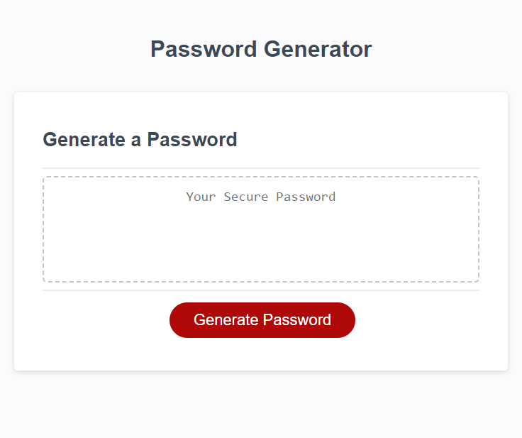

# Password Generator Starter Code

## Description

This application will help users generate a random password with the an array of 4 character sets.
The random aspect of the password will make the password harder to guess.

## Installation

N/A

## Usage

Link to application
[https://billyg04t.github.io/mod-challenge-3/]

Screen shot:

Click the "Generate Password" button and answer each alert. 

## Credits

I used SnapChat's "My AI" program to help out with semantic issues regarding password generations in Javascript as well as declaring "const" for the generator's logic.

Modules 3 and 4 of the Vanderbilt Full Stack Web Development Program were referenced in the Javascript Code.

The starter code came from friendly-parakeet's git lab.
https://github.com/coding-boot-camp/friendly-parakeet.git

## License

MIT License

Copyright (c) 2023 billyg04t

Permission is hereby granted, free of charge, to any person obtaining a copy
of this software and associated documentation files (the "Software"), to deal
in the Software without restriction, including without limitation the rights
to use, copy, modify, merge, publish, distribute, sublicense, and/or sell
copies of the Software, and to permit persons to whom the Software is
furnished to do so, subject to the following conditions:

The above copyright notice and this permission notice shall be included in all
copies or substantial portions of the Software.

THE SOFTWARE IS PROVIDED "AS IS", WITHOUT WARRANTY OF ANY KIND, EXPRESS OR
IMPLIED, INCLUDING BUT NOT LIMITED TO THE WARRANTIES OF MERCHANTABILITY,
FITNESS FOR A PARTICULAR PURPOSE AND NONINFRINGEMENT. IN NO EVENT SHALL THE
AUTHORS OR COPYRIGHT HOLDERS BE LIABLE FOR ANY CLAIM, DAMAGES OR OTHER
LIABILITY, WHETHER IN AN ACTION OF CONTRACT, TORT OR OTHERWISE, ARISING FROM,
OUT OF OR IN CONNECTION WITH THE SOFTWARE OR THE USE OR OTHER DEALINGS IN THE
SOFTWARE.